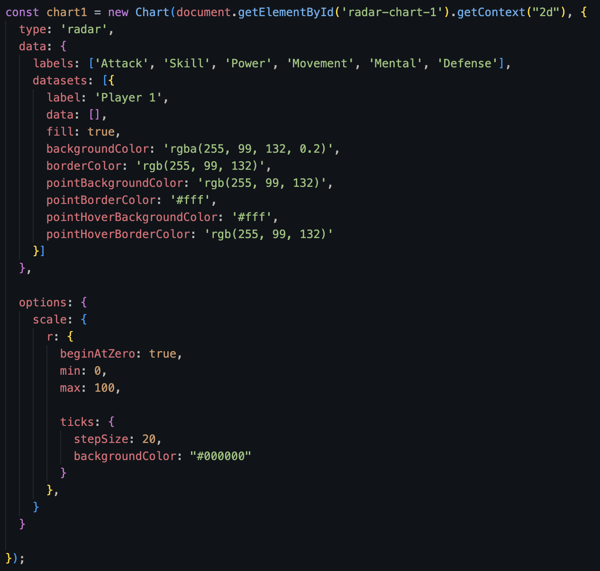

# FIFA22_RadarViz

FIFA22_RadarViz is a data visualizer that allows users to compare the statistics and attributes of two football (soccer) players in a form of a radar chart and a list of statistics for each. Users will be able to use three drop down menus (league, team, player) to select a desired player and diplay their information (name, age, height, nationality, position, preferred foot ), photo, and radar chart which shows 6 attribues: Attack, Skill, Power, Movement, Mental, Defense. 

## Functionality & MVPs

Users of FootballerStats data visualizer are able to:

- [x] Compare the statistics and attributes of two players 
- [x] Use three drop down menus to find a player based on their league and team

- [x] Display interactive radar chart

## Technologies, Libraries, APIs

- [x] Vanilla JS: handling drop down menus and toggles 
- [x] D3.js: rendering radar charts 
- [x] HTML5 / CSS: caching files locally and designing the application 

## Implementation Timeline

- [x] Thursday Afternoon: Submit initial proposal, create repo, make wireframe, and finish final proposal
- [x] Friday Afternoon and Weekend: research d3.js, acquire data, and start setting up basic functionalities 
- [x] Monday: Write backend logic 
- [x] Tuesday: Build out front end 
- [x] Wednesday: Refine the features and dry up the code 
- [x] Thursday: Finish project

## Wireframes 

    

